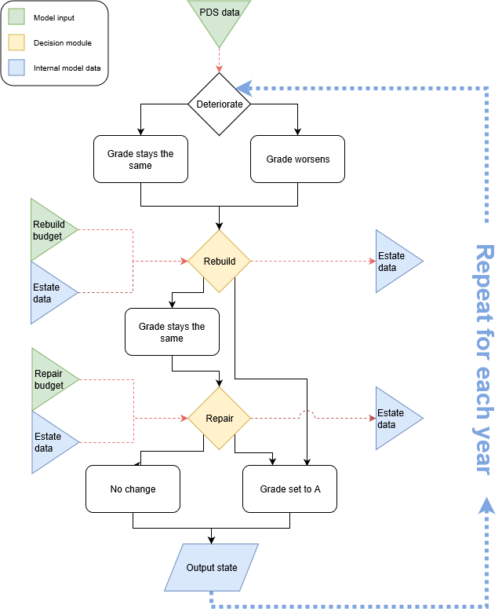

```{r setup, include = FALSE}
knitr::opts_chunk$set(
  collapse = TRUE,
  comment = "#>"
)
```

This vignette provides detailed information on how the Blockbuster Deterioration Model works. 

# Overview

The Blockbuster Deterioration Model simulates the deterioration of individual building components (walls, roofs, etc) on a yearly basis. 

A component can be in one of five conditions:

| Grade | Condition |
|---|:---|
| A | Excellent |
| B | Acceptable |
| C | Requires maintenance |
| D | Poor |
| E | (optional) Failed |

Every component has associated deterioration rates which give the probability that
the component will drop from its current grade to the next worse within a year. For example, in the following figure we see that
this wall has a 9.5% chance of dropping to grade D within a year if it is at grade C.

```{r out.width = "100%", echo = FALSE}
knitr::include_graphics("images/wall with deterioration rates.png")
```

During simulation, the Blockbuster Deterioration Model does not store the current grade of all components, but instead it stores the **probability** that a component is at each grade. This is for computational reasons.  For more information on a variant model approach that instead stores **grades** rather than **probability of grades** see the section on the [Monte Carlo approach](#Montecarlo), but be aware that it is only suitable for simulating individual blocks.

The following flowchart describes how each component is simulated.

```{r out.width = "100%", echo = FALSE}

```

Components are first deteriorated, then the Blockbuster Deterioration Model determines which buildings will be rebuilt.  It
makes this decision based on the probable condition and cost associated with the other modelled components and the user-input 
funding allocated for the yearly **rebuilding** budget. The model rebuilds blocks in order of cost-efficiency which is measured as the ratio between the expected cost to repair all components in a block and the cost to rebuild the block.  For more detail on how it makes these decisions, see the section on [rebuilding blocks](#rebuild).

Then, the Blockbuster determines which components will be repaired.  Again, it makes these decisions based on the state of the other modelled components and the user-input yearly **repair** budget. Standard behaviour is to simulate planned and preventative maintenance by assessing the expected cost of repairing all grade B components.  These components are repaired if there is money left, the model moves on to grades C, D, and finally E. This behaviour is modifiable. For more detail on how it makes these decisions, see the section on [repairing components](#repair).

At the end of this process we are left with updated probabilities that a component is at 
a particular grade.  This process is then repeated according for each year we wish to simulate.

The model output consists of a set of probabilities for each component.  For example, a wall could start at grade B (as represented by the probabilities in the below table).

| Component | Prob. at A | Prob. at B | Prob. at C | Prob. at D | Prob. at E |
|:---|---:|---:|---:|---:|---:|
| Concrete Wall | 0 | 1 | 0 | 0 | 0 |

After a few years of deterioration something like the following table could be expected.

| Component | Prob. at A | Prob. at B | Prob. at C | Prob. at D | Prob. at E |
|:---|---:|---:|---:|---:|---:|
| Concrete Wall | 0.15 | 0.47 | 0.13 | 0.18 | 0.07 |

When combined with information on the cost of repairing components of all types at all grades, and the relative size of all components, it allows us to estimate the backlog associated with the modelled components.

## Assumptions

The methodology stated above implies several assumptions.

- There is no geographic component within the model.  Money for repairs and rebuilding is
allocated strictly by the ranking of components and blocks.  There are no adjustments to maintenance costs and rebuilding costs due to location. Geographic and administrative information is available for all schools so rules could be formulated to
better reflect reality.
- It is assumed that the supplied budgets are to be applied to the data supplied.  The PDS data covers ~85% of the school estate so inputs should be adjusted accordingly if the entirety of the PDS data is used for the initial state.

Further assumptions are implied by the way the various processes ([Deterioration](#deterioration), [Repair](#repair) and [Rebuild](#rebuild)) of the model work. Further details can be found in the sections on each process,

# Deterioration {#deterioration}

At a given time *i*, the model stores the probabilities $p_{A,i}, p_{B,i}, p_{C,i}$ and $p_{D,i}$ that a component is at grade A, B, C or D respectively.  Each component type has a set of deterioration probabilities (or rates) $p_{ab}, p_{bc}, p_{cd}, p_{de}$ that define the probability a component will degrade from grade A to B, B to C, C to D and D to E respectively.  The conditional probability function at time $i+1$ is therefore 

$$p_{i+1}(x) = \begin{cases} p_{A,i}\left(1 - p_{ab}\right) & x = A,\\
p_{A,i}p_{ab} + p_{B,i}\left(1 - p_{bc}\right) & x = B,\\
p_{B,i}p_{bc} + p_{C,i}\left(1 - p_{cd}\right) & x = C\\
p_{C,i}p_{cd} + p_{D,i}\left(1 - p_{de}\right) & x = D\\
p_{D,i}p_{de} + p_{E,i} & x = E.
\end{cases}$$

## Assumptions
- Deterioration probabilities are set for component types and grades. Therefore all components of the same type and grade deteriorate at the same rate.

*Counterexample:* the roof of a school in an area
with more rain / snow / hail / wind is likely to degrade faster than the roof of 
a school with a better climate.  Therefore we are assuming to some extent that
the design of a building is ameliorating the impact of local factors on degradation.

- Each component in the estate deteriorates independently of other components.

*Counterexample:* A leaky
roof is likely to result in damage to components it is protecting.

- The deterioration probability is higher for a component in worse condition. This is the general industry thought on component degradation, but could
be incorrect (it could be confounded by the idea that preventative maintenance is
more effective than reactive maintenance - a regularly maintained component stays
at a higher grade for longer than one that is not maintained and is therefore in
poorer condition).
- The size and type of a building does not affect the deterioration probabilities.
- The deterioration probabilities of components assumes that all components are
subject to the same general level of small maintenance and patchwork projects that are not
captured within the Capital budget.


## Quality Assurance

The deterioration probabilities $p_{ab}, p_{bc}, p_{cd}, p_{de}$ are the most critical part of the model. There are 12 component types within the PDS data: Roofs; floors and stairs; ceilings; external walls, windows and doors; internal walls and doors; sanitary services; mechanical services; electrical services; redecorations; fixed furniture and fittings; external areas;and playing fields. Lifetime estimates at grades A to D were provided for these 12 component types by EC Harris.  These life time estimates are converted to yearly rates using the simple formula
$$deterioration~probability~at~grade = \frac{1}{lifetime~estimate~at~grade}.$$
Since each component type includes many different sub-element types and construction materials it is necessary to use internal expert opinion to refine these 12 deterioration rates further.  For example. The deterioration probability for brick walls is less than the deterioration probability for timber framed curtain walls.  
The adjusted deterioration then underwent a further QA process using an outside construction expert Roger Thompson, to assess whether the final rates were realistic. A small number of probabilities were then tweaked according to this feedback.

We hope to use Condition Data Collection (CDC) data to validate or train the deterioration probabilities once it is available.


# Rebuild decisions {#rebuild}

The Deterioration Model makes decisions on what blocks to repair based on cost-effectiveness.  It orders blocks in descending order of a *cost effectiveness measure* defined as the ratio between the expected cost to repair all grade C, D and E components in a block with the estimated cost to rebuild the entire block.Similarly to the approach used for repairing, the Deterioration Model rebuilds what it can afford by going down the list and rebuilding those with highest cost-effectiveness first, until it can no longer afford any rebuilding.

## Assumptions

The method used to determine which blocks are repaired implies several assumptions:

- There is a fixed rebuild cost per sq.m for buildings.

*Counterexample:* London costs should be higher. Applying location factors to rebuild costs is feasible in the model and will be added later.

- Blocks are rebuilt to the exact same specification: same size, and same components.

- Excess funds are NOT carried over to the next time period.

# Repair decisions {#repair}

The user inputs the amount of available funds for repair for each simulated year.  The model has to decide which components to repair.

The algorithm to do so is as follows:

1. Input: the repair budget, the current state of all components, an ordered list of condition grades used to prioritise repairs;
1. The first grade is selected from the list;
2. The components are ordered in descending order of expected repair cost *at that grade*. i.e. If grade C is selected then the components are ordered by $$expected~cost~of~repair = area~of~component \times unit~cost~to~repair~at~grade~C \times probability~component~is~grade~C$$;
3. A greedy algorithm is used to decide what to repair. In decreasing order of $expected~cost~of~repair$, items are selected for repair if there are available funds and the appropriate $expected~cost~of~repair$ deducted from the total available funds until there are no more affordable components to repair or funds available.
4. Set the probability of a repaired component being at grade A to the probability it is at A plus the probability it was at the given grade.  In our example, we would set $p_{A,i+1} = p_{A,i}+p_{C,i}$.
5. Set the probabiliity of a repaired component being at the grade to 0. In our example, we set $p_{C,i+1}$ to zero.
6. If there are funds still available the next grade is selected from the list and the algorithm returns to step 2.

The Deterioration Model is currently undergoing a review process that may result in an alternative method being used to determine how repair funds are allocated to component repairs.

## Assumptions
The preceeding algorithm implies the following assumptions.

- Components are repaired independently.

*Counterexample:* If you have to fix the 
built-in lights, you may as well repair the ceiling they are part of too.

- Each component has a fixed repair cost per sq.m.

*Counterexample:* Maintenance could be more expensive in London. Location factors can be built into the model if required to reflect the additional cost of maintenance in, say, London.

- Repairing a component costs more as the component condition worsens.  This can
be adjusted by changing the model parameters.

- Excess funds are not carried over to the following year.

# Variant decision making

It is possible to come up with any number of methods for the Deterioration Model to decide how to use the repair and rebuild funds each year.  The methodology described previously is designed to be simple (therefore speeding the model up) yet still capture some of the nuances of decision making.  The Deterioration Model is currently subject to an external review panel with the intention of 
producing decision making modules that better reflect the journey of funds from the central budget, down to responsible bodies and to individual rebuilds and component repairs.

# Monte Carlo variation {#Montecarlo}

Currently the Deterioration Model is a deterministic simulation.  Although it is modelling probabilities, it is using expected values to decide on rebuilds and repairs.  Given the same inputs, two model runs will therefore have the same output.  Although not yet implemented, it is possible to sample the state of the components at each timestep and create a stochastic process where decision making would then be based on the current cost of repairs and cost-effectiveness rather than the expected values.  This approach would eliminate some of the systematic bias created by the model, and would allow the use of Monte Carlo methods to build distributions of outputs. The disadvantage is the increased computational time, so this method may only be suitable for small slices of the school estate. 
